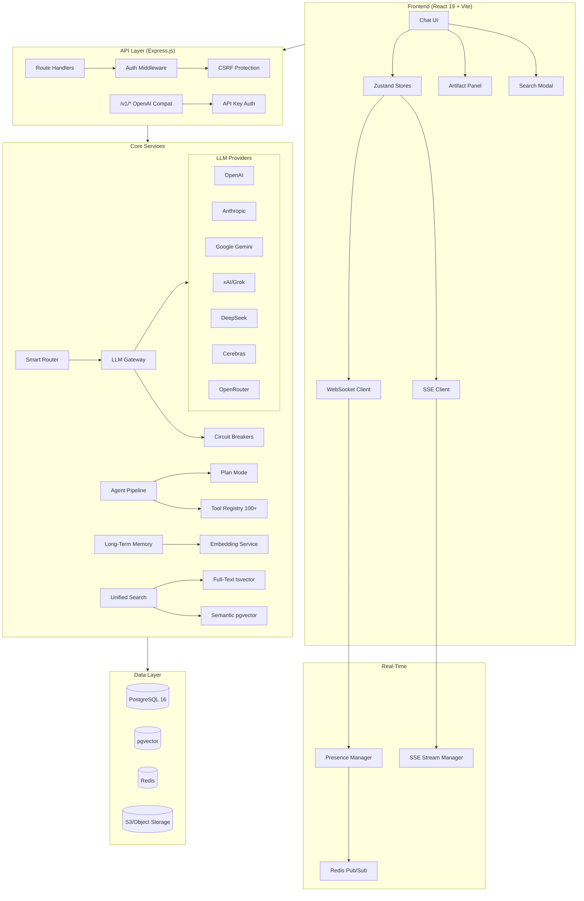
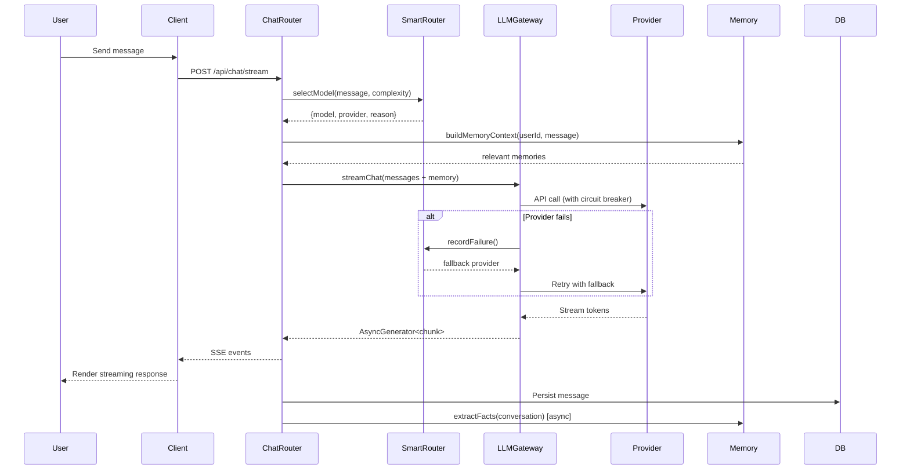
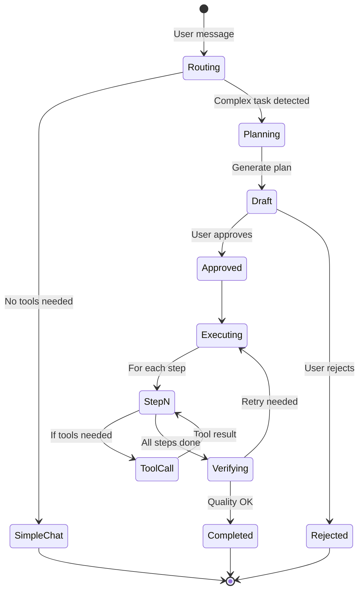
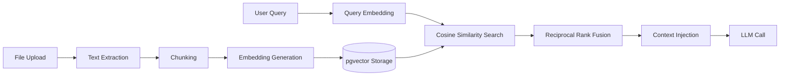

# IliaGPT Architecture

## System Overview



## Chat Pipeline



## Agent Pipeline



## RAG Pipeline



## Directory Structure

```
iliagpt.io/
├── client/                    # React 19 + Vite frontend
│   ├── src/
│   │   ├── components/        # UI components
│   │   │   ├── artifacts/     # Artifact panel (code, html, table, diagram)
│   │   │   ├── chat/          # Chat interface, message list, plan UI
│   │   │   ├── ui/            # shadcn/ui primitives
│   │   │   └── admin/         # Admin dashboard
│   │   ├── stores/            # Zustand state (chat, agent, artifact, streaming)
│   │   ├── hooks/             # React hooks (usePresence, useShikiHighlight, etc.)
│   │   ├── lib/               # Utilities (shikiHighlighter, animations, etc.)
│   │   └── locales/           # i18n (103 locales)
│   └── index.html
├── server/                    # Express.js backend
│   ├── agent/                 # Agent system
│   │   ├── langgraph/         # DAG orchestration
│   │   ├── superAgent/        # Self-improving agent
│   │   ├── planMode.ts        # Plan generation/execution
│   │   └── browser/           # Web automation
│   ├── api/v1/                # OpenAI-compatible API
│   ├── lib/                   # Core libraries
│   │   ├── llmGateway.ts      # Multi-provider LLM gateway
│   │   ├── circuitBreaker.ts  # Per-provider circuit breakers
│   │   ├── tokenCounter.ts    # js-tiktoken + gpt-tokenizer
│   │   └── markdownSanitizer.ts # DOMPurify + sanitize-html
│   ├── llm/
│   │   └── smartRouter.ts     # Cost-aware model selection
│   ├── memory/
│   │   └── longTermMemory.ts  # Cross-session fact extraction
│   ├── search/
│   │   └── unifiedSearch.ts   # Hybrid tsvector + pgvector search
│   ├── realtime/
│   │   └── presence.ts        # Online status, typing indicators
│   ├── routes/                # Express route handlers
│   └── services/              # Business logic services
├── shared/                    # Shared types + Drizzle schemas
│   └── schema.ts              # ~3300 lines, all DB table definitions
├── migrations/                # Drizzle SQL migrations
├── fastapi_sse/               # Python microservice (tool sandbox)
├── desktop/                   # Electron wrapper
├── extension/                 # Chrome extension
└── e2e/                       # Playwright E2E tests
```

## Key Technologies

| Layer | Technology | Purpose |
|-------|-----------|---------|
| Frontend | React 19, Vite 7, Wouter, Zustand | SPA with streaming UI |
| UI | shadcn/ui, TailwindCSS 4, Radix | Component library |
| Syntax | Shiki (primary), Prism.js (fallback) | Code highlighting |
| Backend | Express.js, TypeScript | API server |
| Database | PostgreSQL 16 + pgvector | Relational + vector |
| Cache | Redis (ioredis) | Sessions, pub/sub, rate limits |
| Queue | BullMQ | Background jobs |
| LLM | Multi-provider gateway | 7 providers |
| Search | tsvector + pgvector + RRF | Hybrid search |
| Auth | Passport.js, Google/MS/Auth0 OAuth | Multi-provider auth |
| Docs | docx, exceljs, pptxgenjs, pdfkit | Document generation |
| Browser | Playwright | Web automation |
| Desktop | Electron | Desktop app |
| Testing | Vitest, Playwright | Unit + E2E |
| Observability | Pino, OpenTelemetry, Prometheus | Logging + tracing |
